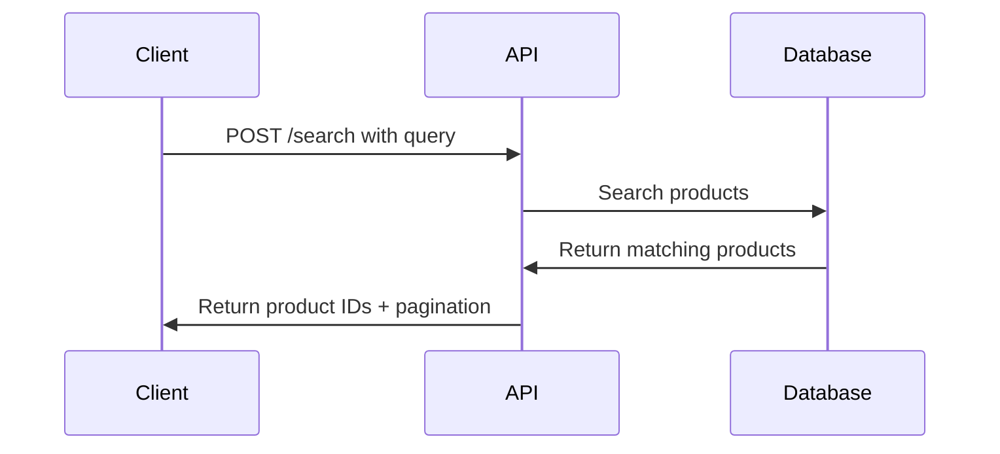

# Product Search API Overview

Integrate the Product Search API to deliver intelligent, relevant results from your catalog. This guide provides a comprehensive overview of search functionality and available endpoints.

## Introduction

The Search API provides intelligent product search capabilities for your catalog. It processes search queries and returns relevant product matches with pagination support.

## Key Features

- **Product Search**: Find products by name, category, or attributes
- **Pagination**: Handle large result sets efficiently
- **Session Tracking**: Track user search behavior
- **Multi-language Support**: Search in different languages
- **Real-time Results**: Fast response times for better user experience

## Endpoint

```
POST https://catalog.api.fashionaiale.com/api/v1/products/protected/recommendation
```

## Quick Start

1. **Get Your Token**: Obtain your API token from the dashboard
2. **Make a Request**: Send a POST request with your search query
3. **Handle Results**: Process the returned product IDs
4. **Implement Pagination**: Use page and limit parameters for large datasets

## Request Flow



## Response Structure

The API returns a consistent response structure:

```json
{
  "totalItems": 47,
  "totalPages": 5,
  "currentPage": 1,
  "items": ["147748", "149250", "148070"]
}
```

## Next Steps

- [Authentication](./authentication) - Learn how to authenticate your requests
- [Implementation Examples](./examples) - See code examples in different languages
- [Best Practices](./best-practices) - Optimize your search implementation