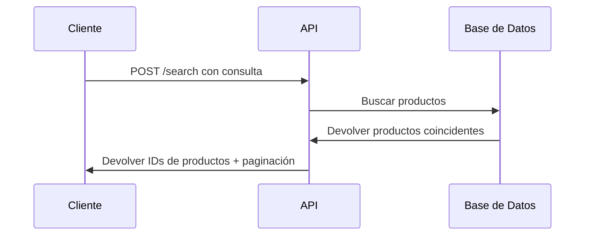

# Descripción General de Búsqueda de Productos

Integra la API de Búsqueda de Productos para entregar resultados inteligentes y relevantes de tu catálogo. Esta guía proporciona una descripción completa de la funcionalidad de búsqueda y los endpoints disponibles.

## Introducción

La API de Búsqueda proporciona capacidades de búsqueda inteligente de productos para tu catálogo. Procesa consultas de búsqueda y devuelve coincidencias de productos relevantes con soporte de paginación.

## Características Clave

- **Búsqueda de Productos**: Encuentra productos por nombre, categoría o atributos
- **Paginación**: Maneja conjuntos de resultados grandes de manera eficiente
- **Seguimiento de Sesión**: Rastrea el comportamiento de búsqueda del usuario
- **Soporte Multiidioma**: Búsqueda en diferentes idiomas
- **Resultados en Tiempo Real**: Tiempos de respuesta rápidos para mejor experiencia de usuario

## Endpoint

```
POST https://catalog.api.fashionaiale.com/api/v1/products/protected/search?page={page}&limit={limit}&query={query}
```

## Inicio Rápido

1. **Obtén Tu Token**: Obtén tu token de API desde el panel de control
2. **Realiza una Solicitud**: Envía una solicitud POST con tu consulta de búsqueda
3. **Maneja Resultados**: Procesa los IDs de productos devueltos
4. **Implementa Paginación**: Usa los parámetros de página y límite para conjuntos de datos grandes

## Flujo de Solicitud



## Estructura de Respuesta

La API devuelve una estructura de respuesta consistente:

```json
{
  "totalItems": 47,
  "totalPages": 5,
  "currentPage": 1,
  "items": ["147748", "149250", "148070"]
}
```

## Próximos Pasos

- [Autenticación](../authentication) - Aprende cómo autenticar tus solicitudes
- [Ejemplos de Implementación](./examples) - Ver ejemplos de código en diferentes lenguajes
