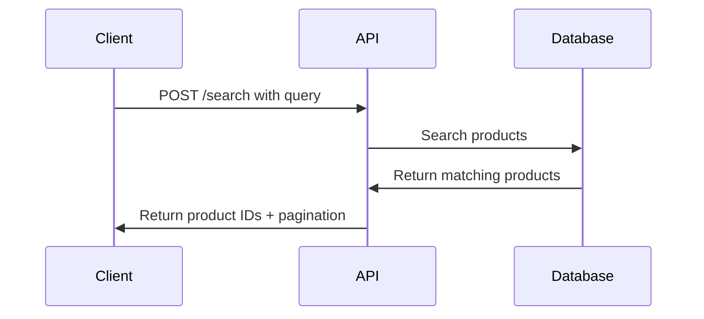

# Resumen de Búsqueda de Productos

Integra la API de Búsqueda de Productos para entregar resultados inteligentes y relevantes de tu catálogo. Esta guía proporciona un resumen completo de la funcionalidad de búsqueda y endpoints disponibles.

## Introducción

La API de Búsqueda proporciona capacidades inteligentes de búsqueda de productos para tu catálogo. Procesa consultas de búsqueda y devuelve coincidencias relevantes de productos con soporte de paginación.

## Características Principales

- **Búsqueda de Productos**: Encuentra productos por nombre, categoría o atributos
- **Paginación**: Maneja grandes conjuntos de resultados eficientemente
- **Rastreo de Sesión**: Rastrea el comportamiento de búsqueda del usuario
- **Soporte Multi-idioma**: Busca en diferentes idiomas
- **Resultados en Tiempo Real**: Tiempos de respuesta rápidos para mejor experiencia del usuario

## Endpoint

```
POST https://catalog.api.fashionaiale.com/api/v1/products/protected/search?page={page}&limit={limit}&query={query}
```

## Inicio Rápido

1. **Obtén tu Token**: Obtén tu token de API desde el dashboard
2. **Haz una Solicitud**: Envía una solicitud POST con tu consulta de búsqueda
3. **Maneja Resultados**: Procesa los IDs de productos devueltos
4. **Implementa Paginación**: Usa parámetros de página y límite para grandes conjuntos de datos

## Flujo de Solicitud



## Estructura de Respuesta

La API devuelve una estructura de respuesta consistente:

```json
{
  "totalItems": 47,
  "totalPages": 5,
  "currentPage": 1,
  "items": ["147748", "149250", "148070"]
}
```

## Próximos Pasos

- [Autenticación](../authentication) - Aprende cómo autenticar tus solicitudes
- [Ejemplos de Implementación](./examples) - Ve ejemplos de código en diferentes lenguajes
