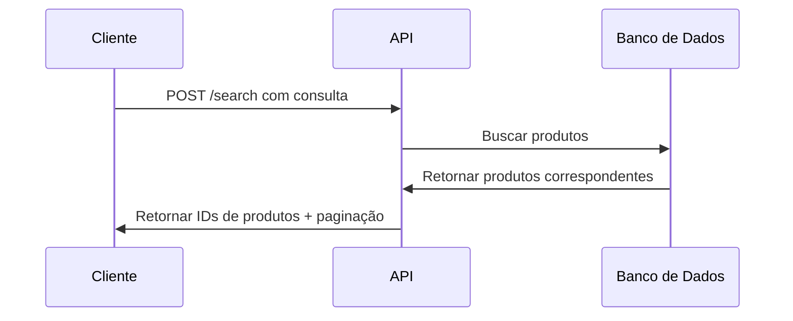

# Visão Geral da API de Busca de Produtos

Integre a API de Busca de Produtos para entregar resultados inteligentes e relevantes do seu catálogo. Este guia fornece uma visão geral abrangente da funcionalidade de busca e endpoints disponíveis.

## Introdução

A API de Busca fornece capacidades inteligentes de busca de produtos para seu catálogo. Ela processa consultas de busca e retorna produtos relevantes com suporte à paginação.

## Recursos Principais

- **Busca de Produtos**: Encontre produtos por nome, categoria ou atributos
- **Paginação**: Manipule grandes conjuntos de resultados de forma eficiente
- **Rastreamento de Sessão**: Acompanhe o comportamento de busca do usuário
- **Suporte Multi-idioma**: Busque em diferentes idiomas
- **Resultados em Tempo Real**: Tempos de resposta rápidos para melhor experiência do usuário

## Endpoint

```
POST https://catalog.api.fashionaiale.com/api/v1/products/protected/recommendation
```

## Início Rápido

1. **Obtenha Seu Token**: Obtenha seu token da API no dashboard
2. **Faça uma Solicitação**: Envie uma solicitação POST com sua consulta de busca
3. **Manipule os Resultados**: Processe os IDs de produtos retornados
4. **Implemente Paginação**: Use parâmetros de página e limite para grandes conjuntos de dados

## Fluxo de Solicitação



## Estrutura de Resposta

A API retorna uma estrutura de resposta consistente:

```json
{
  "totalItems": 47,
  "totalPages": 5,
  "currentPage": 1,
  "items": ["147748", "149250", "148070"]
}
```

## Próximos Passos

- [Autenticação](./authentication) - Aprenda como autenticar suas solicitações
- [Exemplos de Implementação](./examples) - Veja exemplos de código em diferentes linguagens
- [Melhores Práticas](./best-practices) - Otimize sua implementação de busca